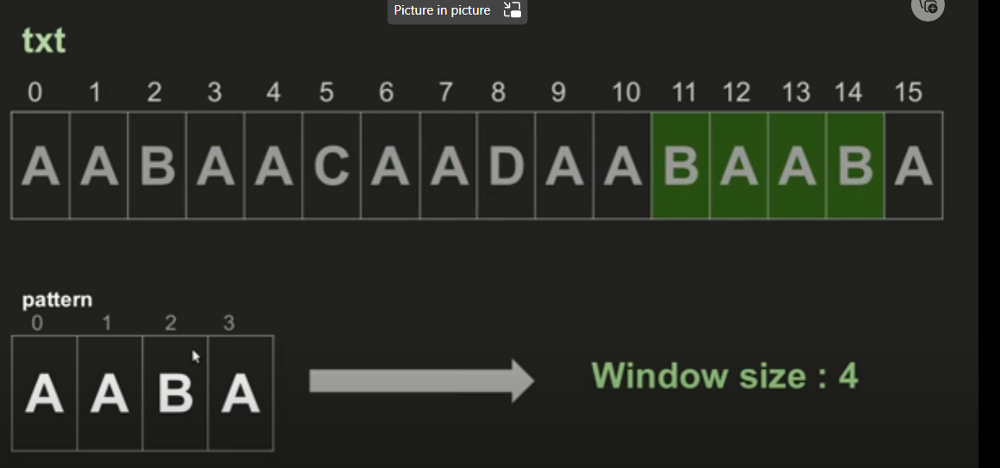

Naive Algorithms

Naive algorithms are simple, intuitive algorithms that are often used as a first solution to a problem. While naive algorithms may not be the most efficient, they provide a straightforward approach that is easy to implement and understand. Here are some key features of naive algorithms:

-   Simplicity - Naive algorithms use basic operations and data structures. This makes them easy to code, debug, and modify.
    
-   Intuitiveness - The logic behind a naive algorithm aligns closely with how a human would manually approach the problem. This makes them easy to conceptualize.
    
-   Inefficiency - Because naive algorithms do not optimize for efficiency, they often have poor time and space complexity compared to more advanced algorithms. This makes them impractical for large inputs.
    
-   Suboptimal solutions - Naive algorithms provide a reasonable but not perfect solution to a problem. This is because they do not account for all edge cases or optimize the approach.
    

Some common examples of naive algorithms include:

-   Linear search - Sequentially checks each element of a list for the target value. Runs in O(n) time.
    
-   Bubble sort - Repeatedly swaps adjacent elements if they are out of order. Runs in O(n^2) time.
    
-   Fibonacci - Calculates each Fibonacci number from scratch. Runs in exponential time.
    

While naive algorithms have limitations, they provide a simple starting point when developing solutions. More advanced algorithms can then optimize upon the naive approach. Understanding both types of algorithms is important for becoming an effective programmer.